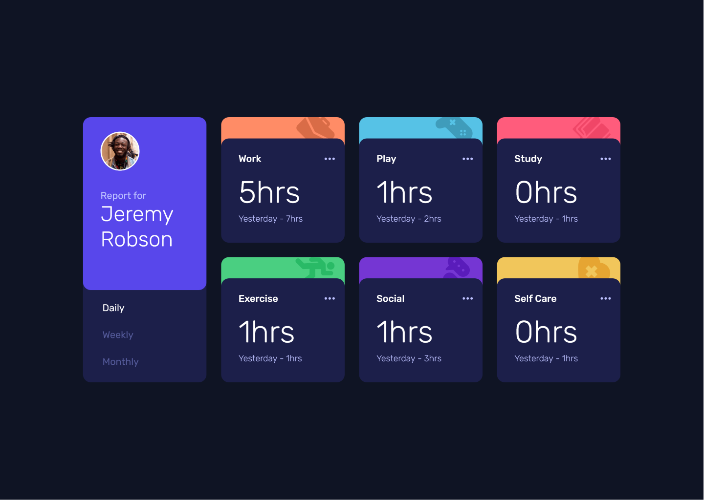

# Frontend Mentor - Time tracking dashboard solution

This is a solution to the [Time tracking dashboard challenge on Frontend Mentor](https://www.frontendmentor.io/challenges/time-tracking-dashboard-UIQ7167Jw).

## Table of contents

- [Overview](#overview)
  - [The challenge](#the-challenge)
  - [Screenshot](#screenshot)
  - [Links](#links)
- [My process](#my-process)
  - [Built with](#built-with)
  - [What I learned](#what-i-learned)
- [Author](#author)

## Overview

### The challenge

Users should be able to:

- View the optimal layout for the site depending on their device's screen size
- See hover states for all interactive elements on the page
- Switch between viewing Daily, Weekly, and Monthly stats

### Screenshot



### Links

- Solution URL: [Add solution URL here](https://your-solution-url.com)
- Live Site URL: [Add live site URL here](https://your-live-site-url.com)

## My process

### Built with

- CSS custom properties
- Flexbox
- CSS Grid
- Mobile-first workflow
- [React](https://reactjs.org/) - JS library
- [Vite](https://vitejs.dev/)

### What I learned

It has been a very fun and cool project to work on cause it was my first time to use the react library on a project and thanks to that I learned a lot.

one interesting thing that I learned in this project is that you can include your svg asset cleanly in your code by wrapping it in a react component and importing it rather than including it directly in your code or using the `` tag which prevents you from changing the svg fill, and one cool plugin that helped me with this is the vite **svgr** plugin which enables you to import them in your code directly as react components rather than manualy creating them.

```js
import { ReactComponent as Threedots } from "../images/icon-ellipsis.svg";
```

I also learned that you can render components dynamically based on the fetched data:

```js
{
  data.map((e) => {
    return (
      <DashBoardCard
        key={crypto.randomUUID()}
        title={e.title}
        timeInfo={e.timeframes[timeFrame]}
        prevText={formatPreviousText()}
      />
    );
  });
}
```

I also learned of how you can share one state between multiple components by simply lifting it to the closest ancestor and passing down the state and a callback function to update it via props.

```js
const [timeFrame, setTimeFrame] = useState("weekly");
```

```js
<div className="grid-container">
  <Reportcard onPress={(timeFrame) => setTimeFrame(timeFrame)} />
  <Dashboard data={timeData} timeFrame={timeFrame} />
</div>
```

## Author

- Linkedin - [@khusseincoder](https://www.linkedin.com/in/khusseincoder/)
- Frontend Mentor - [@Karrar_Hussein](https://www.frontendmentor.io/profile/Karrar-Hussein)
- Twitter - [@khusseincoder](https://www.twitter.com/khusseincoder)
